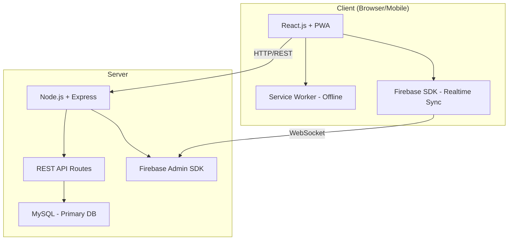

# 📋 Implementation Plan — POS FOTOCOPY ABADI JAYA

## Tujuan
Membangun aplikasi POS full-stack untuk **FOTOCOPY ABADI JAYA** (ATK, Fotocopy, Percetakan, Service Mesin) dengan arsitektur modern dan real-time sync.

---

## Tech Stack

| Layer | Teknologi |
|-------|-----------|
| **Frontend** | React.js (Vite) + PWA |
| **Backend** | Node.js + Express (REST API) |
| **Database** | MySQL (primary) + Firebase Realtime DB (sync) |
| **Auth** | JWT + bcrypt |
| **Styling** | CSS (vanilla, dark theme + glassmorphism) |
| **Font** | Google Fonts (Inter) |

---

## User Review Required

> [!IMPORTANT]
> **Prerequisites yang perlu di-install:**
> - **Node.js** (v18+) — [nodejs.org](https://nodejs.org)
> - **MySQL Server** — [mysql.com](https://dev.mysql.com/downloads/mysql/) atau XAMPP/Laragon
> - **Firebase Project** — perlu buat project di [Firebase Console](https://console.firebase.google.com)
>
> Apakah semua ini sudah terinstall di komputer Anda?

> [!WARNING]
> **Firebase Config**: Anda perlu menyediakan Firebase project credentials (apiKey, authDomain, databaseURL, dll). Saya akan pakai placeholder dulu, nanti Anda ganti dengan credentials asli.

---

## Arsitektur



**Alur Data:**
1. Frontend (React) → REST API → MySQL (data master, transaksi)
2. Firebase Realtime DB → sync status order, notifikasi, dashboard live update
3. PWA → Service Worker → offline access untuk kasir

---

## Proposed Changes

### Backend (Node.js + Express)

#### [NEW] [server/package.json](file:///c:/Users/AJ/Videos/pos/server/package.json)
Dependencies: express, mysql2, firebase-admin, jsonwebtoken, bcryptjs, cors, dotenv, multer

#### [NEW] [server/.env](file:///c:/Users/AJ/Videos/pos/server/.env)
Environment variables: DB_HOST, DB_USER, DB_PASS, DB_NAME, JWT_SECRET, FIREBASE_CONFIG

#### [NEW] [server/index.js](file:///c:/Users/AJ/Videos/pos/server/index.js)
Express server setup, middleware (cors, json parser, auth), route mounting

#### [NEW] [server/config/database.js](file:///c:/Users/AJ/Videos/pos/server/config/database.js)
MySQL connection pool (mysql2/promise)

#### [NEW] [server/config/firebase.js](file:///c:/Users/AJ/Videos/pos/server/config/firebase.js)
Firebase Admin SDK initialization

#### [NEW] [server/middleware/auth.js](file:///c:/Users/AJ/Videos/pos/server/middleware/auth.js)
JWT verification middleware, role-based access control

#### [NEW] [server/routes/](file:///c:/Users/AJ/Videos/pos/server/routes/)
REST API endpoints:
- `auth.js` — POST /login, POST /logout, GET /me
- `products.js` — CRUD /products, GET /categories
- `transactions.js` — CRUD /transactions, POST /transactions/:id/pay
- `photocopy.js` — POST /photocopy (hitung harga, volume discount)
- `printing.js` — CRUD /print-orders, PATCH /print-orders/:id/status
- `service.js` — CRUD /service-orders, PATCH /service-orders/:id/status
- `customers.js` — CRUD /customers, GET /customers/:id/history
- `inventory.js` — GET /stock, POST /stock-in, GET /stock-alerts
- `finance.js` — GET /cashflow, POST /expense, GET /receivables
- `reports.js` — GET /reports/sales, /reports/stock, /reports/finance
- `settings.js` — GET/PUT /settings, GET /activity-log, POST /backup, POST /restore

#### [NEW] [server/models/](file:///c:/Users/AJ/Videos/pos/server/models/)
MySQL queries per table: User, Product, Category, Transaction, PrintOrder, ServiceOrder, Customer, CashFlow, StockMovement, ActivityLog

#### [NEW] [server/database/migrate.js](file:///c:/Users/AJ/Videos/pos/server/database/migrate.js)
Schema creation — semua tabel dari planning (users, products, categories, customers, suppliers, transactions, transaction_details, print_orders, service_orders, cash_flow, stock_movements, activity_log, settings)

#### [NEW] [server/database/seed.js](file:///c:/Users/AJ/Videos/pos/server/database/seed.js)
Demo data: default users, kategori, contoh produk ATK, harga fotocopy, contoh pelanggan

---

### Frontend (React.js + Vite + PWA)

#### [NEW] [client/](file:///c:/Users/AJ/Videos/pos/client/) — Vite React project
Dibuat via `npx create-vite@latest ./ --template react`

#### [NEW] [client/vite.config.js](file:///c:/Users/AJ/Videos/pos/client/vite.config.js)
Vite config + PWA plugin (vite-plugin-pwa)

#### [NEW] [client/public/manifest.json](file:///c:/Users/AJ/Videos/pos/client/public/manifest.json)
PWA manifest: nama app, icons, theme color, display: standalone

#### [NEW] [client/src/main.jsx](file:///c:/Users/AJ/Videos/pos/client/src/main.jsx)
React entry point, router setup, Firebase init

#### [NEW] [client/src/styles/](file:///c:/Users/AJ/Videos/pos/client/src/styles/)
- `index.css` — Design system (CSS vars, dark/light/system theme, glassmorphism)
- `components.css` — Cards, buttons, forms, modals, tables, badges
- `modules.css` — POS layout, kanban, dashboard grid, responsive (mobile/tablet/desktop)

# Fix Theme Consistency & Bluetooth Printing

This plan addresses two critical UI/UX issues:
1. **Inventory Cards Theme Bug**: Mobile inventory cards appear dark even in light mode because a CSS selector `[class*="dark"]` is matching Tailwind's `dark:` variant classes.
2. **Bluetooth Printing Error**: Mobile devices require a Secure Context (HTTPS) to use the Web Bluetooth API.

## Proposed Changes

### Client (UI & Styling)

#### [MODIFY] [index.css](file:///d:/WEB/pos/client/src/index.css)
- Refactor the responsive table-to-card selectors to avoid matching Tailwind classes.
- Change `[class*="dark"] table tbody tr` to `.dark table tbody tr` to ensure it only applies when the global dark mode is active.

#### [MODIFY] [utils.js](file:///d:/WEB/pos/client/src/utils.js)
- Enhance the Bluetooth error message to explain the HTTPS requirement more clearly.

#### [NEW] [client/src/contexts/AuthContext.jsx](file:///c:/Users/AJ/Videos/pos/client/src/contexts/AuthContext.jsx)
Auth state, login/logout, JWT token management, RBAC

#### [NEW] [client/src/contexts/ThemeContext.jsx](file:///c:/Users/AJ/Videos/pos/client/src/contexts/ThemeContext.jsx)
Light/Dark/System theme toggle + `prefers-color-scheme` detection

#### [NEW] [client/src/services/api.js](file:///c:/Users/AJ/Videos/pos/client/src/services/api.js)
Axios/fetch wrapper untuk semua REST API calls

#### [NEW] [client/src/services/firebase.js](file:///c:/Users/AJ/Videos/pos/client/src/services/firebase.js)
Firebase client SDK init + realtime listeners

#### [NEW] [client/src/pages/](file:///c:/Users/AJ/Videos/pos/client/src/pages/)
Pages (1 file per halaman):
- `LoginPage.jsx` — Login form + role selection
- `DashboardPage.jsx` — Summary cards, notifikasi, quick access, mini chart
- `PosPage.jsx` — Kasir ATK (product grid, cart, payment) + Fotocopy (numpad, volume discount)
- `PrintingPage.jsx` — Order percetakan form + ongkir + Kanban board
- `ServicePage.jsx` — Order service form + Kanban board
- `InventoryPage.jsx` — Master produk CRUD, stock alerts, stock movement
- `CustomersPage.jsx` — CRUD pelanggan, riwayat, piutang
- `FinancePage.jsx` — Kas harian, pemasukan/pengeluaran, piutang
- `ReportsPage.jsx` — Laporan penjualan, stok, keuangan, order, pelanggan
- `SettingsPage.jsx` — User management, printer, nota template, WA gateway, backup/restore, log

#### [NEW] [client/src/components/](file:///c:/Users/AJ/Videos/pos/client/src/components/)
Reusable components:
- `Sidebar.jsx`, `Header.jsx`, `Layout.jsx`
- `Modal.jsx`, `Toast.jsx`, `ConfirmDialog.jsx`
- `ProductCard.jsx`, `CartPanel.jsx`, `PaymentModal.jsx`
- `KanbanBoard.jsx`, `KanbanCard.jsx`
- `DataTable.jsx`, `SearchBar.jsx`, `StatusBadge.jsx`
- `Receipt.jsx` (preview struk)

---

## Project Structure

```
c:/Users/AJ/Videos/pos/
├── server/                          # Backend
│   ├── package.json
│   ├── .env
│   ├── index.js                     # Express entry
│   ├── config/
│   │   ├── database.js              # MySQL pool
│   │   └── firebase.js              # Firebase Admin
│   ├── middleware/
│   │   └── auth.js                  # JWT + RBAC
│   ├── routes/                      # 11 route files
│   ├── models/                      # MySQL queries
│   └── database/
│       ├── migrate.js               # Schema
│       └── seed.js                  # Demo data
│
├── client/                          # Frontend (React + PWA)
│   ├── package.json
│   ├── vite.config.js
│   ├── public/
│   │   └── manifest.json
│   └── src/
│       ├── main.jsx
│       ├── App.jsx
│       ├── styles/                  # 3 CSS files
│       ├── contexts/                # Auth + Theme
│       ├── services/                # API + Firebase
│       ├── pages/                   # 10 pages
│       └── components/              # ~15 components
│
└── task.md
```

---

## Verification Plan

### Setup & Run
1. `cd server && npm install && node database/migrate.js && node database/seed.js && npm start`
2. `cd client && npm install && npm run dev`
3. Buka `http://localhost:5173`

### Browser Testing
1. **Login** → admin/kasir/operator/teknisi
2. **Dashboard** → cards, notifikasi, quick access
3. **POS ATK** → cari produk → add cart → payment → stok berkurang
4. **Fotocopy** → pilih kertas → input lembar → volume discount → bayar
5. **Percetakan** → buat order + ongkir → kanban → update status
6. **Service** → buat order → diagnosa → sparepart → update status
7. **Inventory** → CRUD produk → stok alert (table → card di mobile)
8. **Pelanggan** → CRUD → riwayat transaksi
9. **Keuangan** → kas harian → pengeluaran → piutang
10. **Laporan** → filter periode → export
11. **Settings** → backup/restore
12. **Responsive** → desktop (1920px), tablet (768px), mobile (375px) — perbaikan UI mobile (sidebar, table→card, touch-friendly)
13. **PWA** → install ke home screen → test offline
14. **Firebase** → realtime update order status antar device
